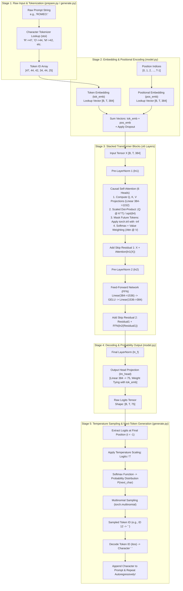

# 🧠 Small Language Model (SLM) from Scratch

A custom ~10.8M parameter **Decoder-only Transformer** (nanoGPT-style) implemented from scratch in **PyTorch**. This repository includes the complete model architecture, data cleaning and character tokenization pipeline, training loop with AdamW optimization, and an autoregressive text generation engine with temperature scaling.

---

## ✨ Features

- **Custom Decoder-Only Architecture**:
  - **Causal Self-Attention**: Multi-head self-attention with causal triangular masking to prevent attending to future tokens.
  - **Pre-LayerNorm Residual Connections**: Stable gradient flow across deep transformer layers.
  - **Feed-Forward Networks**: Expand-and-contract FFN using `GELU` non-linear activation.
  - **Weight Tying**: Shares parameters between the token embedding matrix and the output linear head (`lm_head`).
- **Data & Tokenization Pipeline**:
  - Regex-based text normalization and character-level encoding.
  - Efficient binary array serialization (`np.uint16`) into `.bin` files for high-throughput PyTorch dataset loading.
- **Training Engine**:
  - Optimizes with **AdamW** optimizer and tracks cross-entropy loss across training and validation splits.
  - Saves full checkpoint dictionaries (`model_state`, `model_cfg`, `train_cfg`, `final_loss`).
- **Autoregressive Text Generation**:
  - Temperature-scaled multinomial sampling for controllable output creativity.

---

## 📐 System Architecture & Sequential Input-to-Output Flow

### 🔄 End-to-End Execution Flowchart



### 🔁 Step-by-Step Flow Explanation

1. **Raw Text Input & Tokenization:**
   - Input text (e.g., `"ROMEO:"`) is passed to the tokenizer function `encode()`, converting each character into integer token IDs based on the 75-character lookup dictionary `stoi`.
2. **Dense Vector & Position Embedding:**
   - Token IDs are projected into 384-dimensional continuous space via `tok_emb`.
   - Positional IDs `[0..T-1]` are projected via `pos_emb` to inject sequence order awareness. Both embedding vectors are added together with dropout.
3. **6x Transformer Layers (Attention + FFN):**
   - **LayerNorm 1** normalizes activations before attention.
   - **Causal Self-Attention** projects Q, K, and V vectors across 6 parallel heads, computes scaled dot-product attention, masks out future tokens with $-\infty$, applies Softmax, and adds the original input back via a **residual skip connection**.
   - **LayerNorm 2** normalizes activations before the Feed-Forward Network.
   - **FFN** expands the dimension 4x ($384 \to 1536$), applies `GELU` activation, projects back to 384, and adds the result to the second **residual skip connection**.
4. **Final Normalization & Head Projection:**
   - The tensor passes through `ln_f` (final LayerNorm) and `lm_head` (Linear projection tied to `tok_emb` weights), generating raw logits of shape `[B, T, 75]`.
5. **Autoregressive Sampling Loop:**
   - The final position's logits are scaled by temperature ($z / T$), converted to probabilities via `softmax()`, and sampled using `torch.multinomial()`.
   - The newly generated token is decoded back to a character, printed, appended to the prompt, and fed back into Stage 1 for the next token!

---

## 🏗️ Model & Training Specifications

| Parameter | Value |
| :--- | :--- |
| **Model Parameters** | ~10.8 Million |
| **Embedding Dimension (`n_embd`)** | 384 |
| **Attention Heads (`n_head`)** | 6 (64 dimensions/head) |
| **Transformer Layers (`n_layer`)** | 6 |
| **Context Window (`block_size`)** | 256 tokens |
| **Vocabulary Size (`vocab_size`)** | 75 (character-level) |
| **Training Steps (`max_iters`)** | 5,000 |
| **Batch Size (`batch_size`)** | 64 |
| **Optimizer** | AdamW (`lr=3e-4`) |

---

## 📁 Repository Structure

```
slm_from_scratch/
├── config.py           # Dataclasses defining model and training hyper-parameters
├── model.py            # PyTorch implementation of GPT architecture & blocks
├── prepare.py          # Data cleaning, tokenizer, and binary dataset splitting
├── train.py            # Training loop, loss estimation, and checkpoint saving
├── generate.py         # Autoregressive text generation script
├── data/
│   └── input.txt       # Raw text dataset (Shakespeare corpus)
└── checkpoints/        # Saved model weights (.pt files)
```

---

## 🚀 Quick Start

### 1. Prerequisites & Dependencies

Ensure you have Python 3.9+ and PyTorch installed:

```bash
pip install torch numpy
```

### 2. Prepare the Dataset

Run the pre-processing script to clean the text corpus and generate `train.bin` and `val.bin`:

```bash
python prepare.py
```

### 3. Train the Model

Train the Small Language Model for 5,000 iterations:

```bash
python train.py
```

*The trained model checkpoint will be saved to `checkpoints/base_model.pt`.*

### 4. Generate Text

Generate text using the trained model checkpoint:

```bash
python generate.py
```

---

## 📜 License

MIT License. Free to use and modify for learning and projects.
